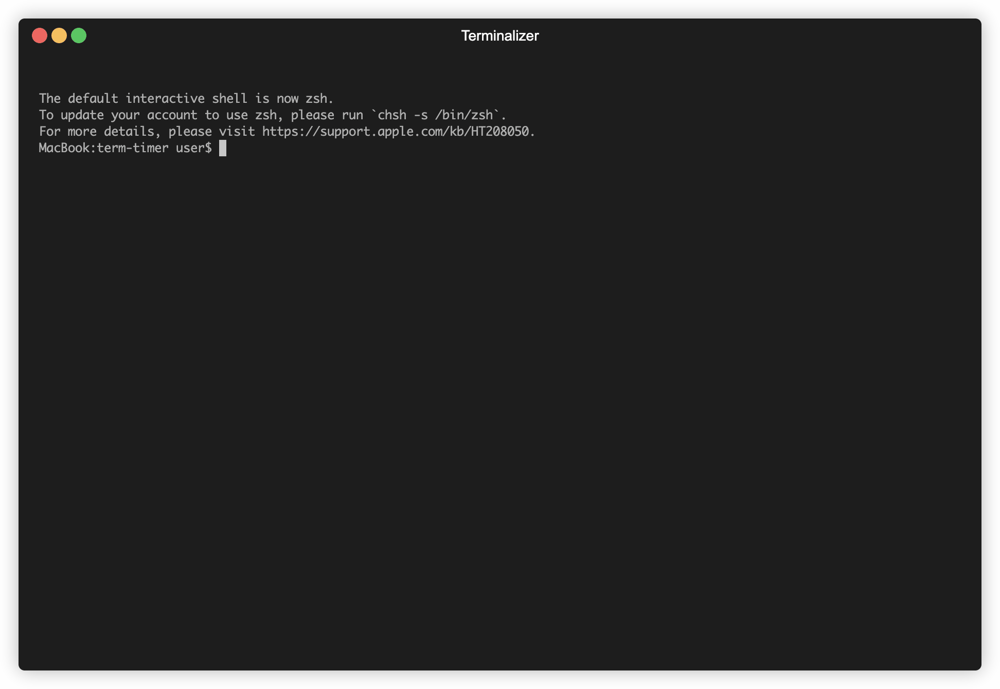

# term-timer
⏳ A simple terminal-based countdown timer with color alerts, sounds, and notifications. ❤️ Built to help my wife focus — and save a few dollars 💵 instead of buying a timer app.



## 🔊 Sound (Optional)

Sound is **commented out by default**.  
Uncomment the `say` line to enable it — it **plays out loud**!

```bash
say "Germaine, Time's up!"
```

---

## 📄 License

This project is licensed under the [MIT License](LICENSE).
